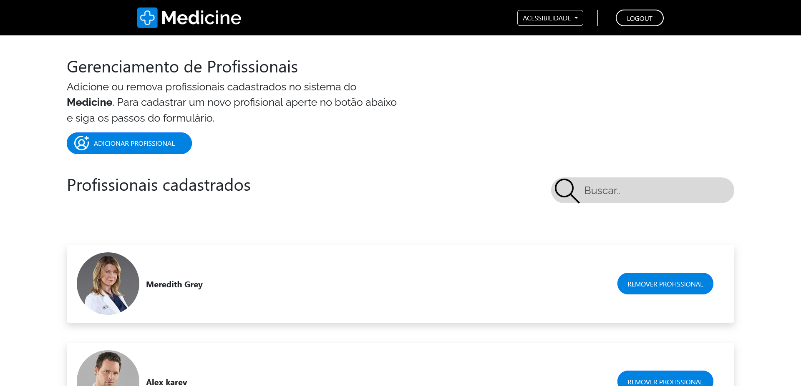
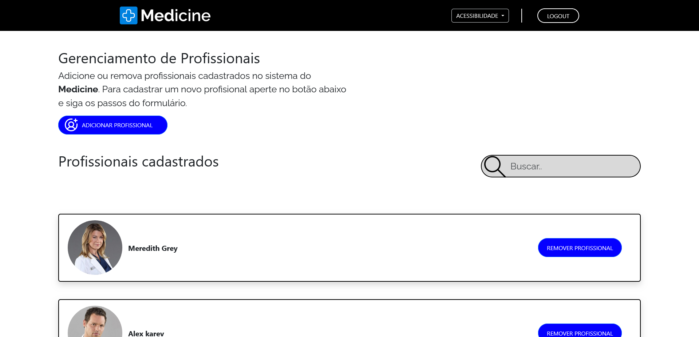
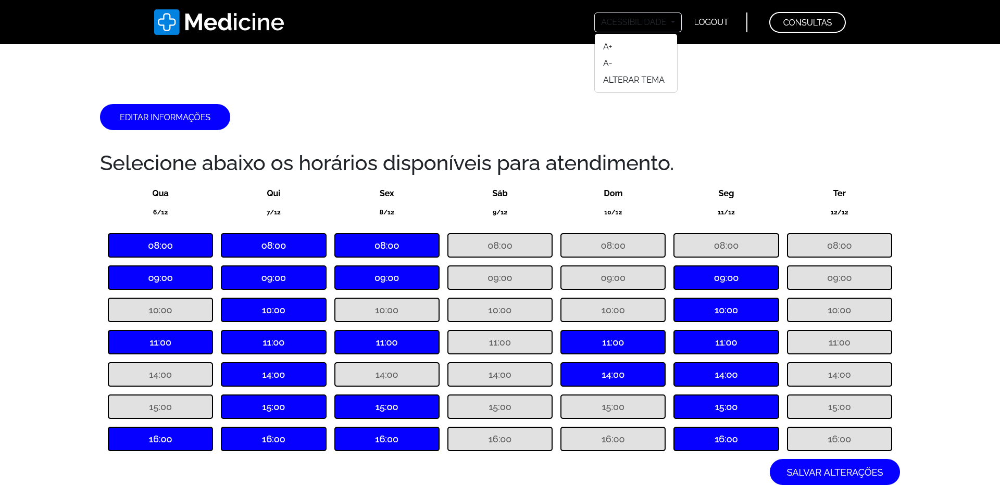
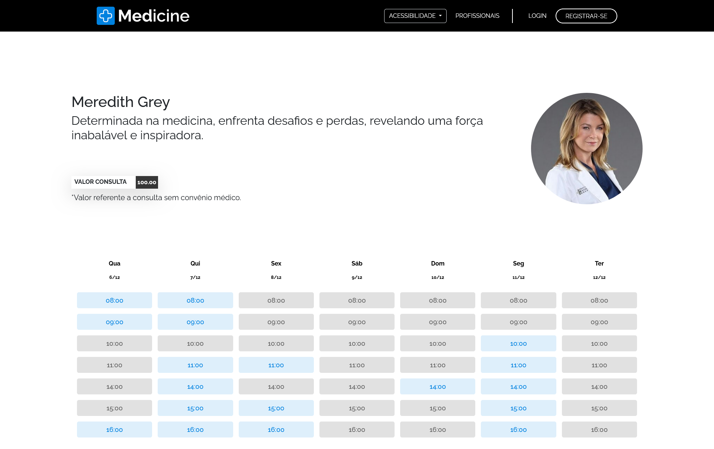
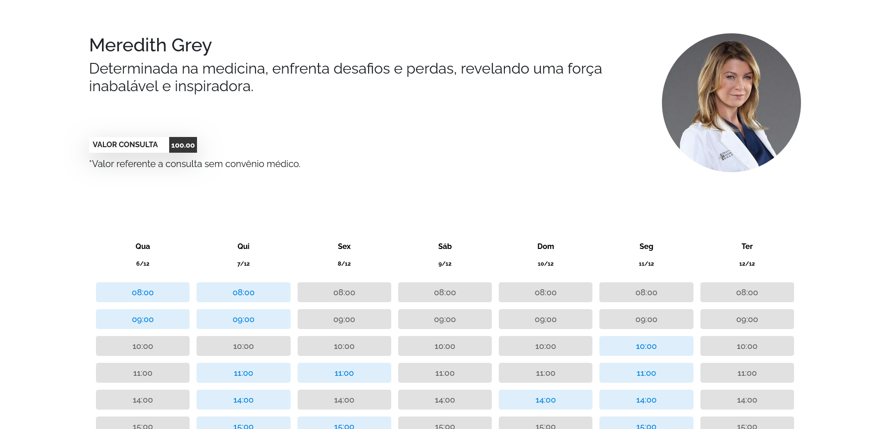

  

  O sistema se propõe em auxiliar pacientes e médicos em agendamentos de consultas de forma online. O usuário pode fazer um cadastro no sistema, selecionar um médico  e marcar um agendamento no horário e dia que preferir sem precisar sair de casa. O médico pode fazer um gerenciamento de seus horários.

### ⚙️ Funcionalidades :

  <strong>Login de usuários:</strong> O público poderá se cadastrar no sistema e fazer login. 
   
   
  <strong>Criar um agendamento:</strong> Os pacientes cadastrados podem cadastrar um agendamento  de consulta no sistema. 
   
   
  <strong>Excluir um agendamento:</strong> Após fazer um agendamento os usuários podem excluir esse agendamento se preferir.
   
   
  <strong>Listar agendamentos:</strong> Os pacientes cadastrados conseguem visualizar em uma tela todas as suas consultas agendadas. 
   
   
  <strong>Alterar horários:</strong> Os médicos conseguem marcar ou desmarcar seus horários disponíveis na agenda de horários para consultas. 
   
   
  <strong>Listar consultas:</strong> Os médicos conseguem visualizar em uma tela todas as consultas agendadas para o mesmo. 
   
   
  <strong>Duas opções de tema:</strong> Todos os usuários podem escolher a opção de paleta de cores do sistema (Black ou White) 
   
   
  <strong>Duas opções de tema:</strong> Todos os usuários podem diminuir ou aumentar o tamanho da fonte de texto do sistema. 

### 🛠 Tecnologias :
- HTML e CSS
- JavaScript
- PostgreSQL
- NodeJS
- Express

### ▶️ Executando a aplicação

``npm install express``
 
``npm install pg``
 
``node server.js``

### Sistema Medicine 👨‍⚕️

  

  

  

  

  

  

  

  

